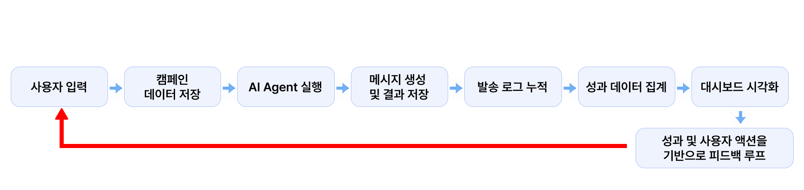
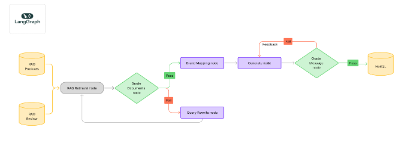
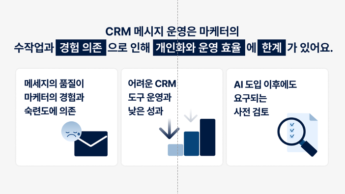
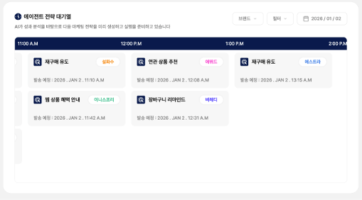
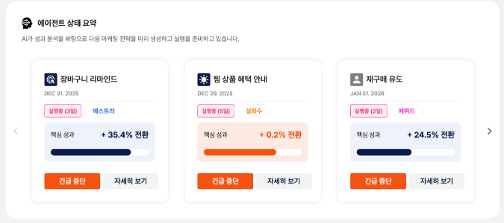
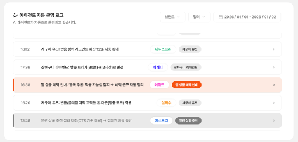
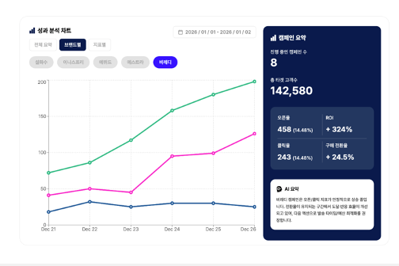
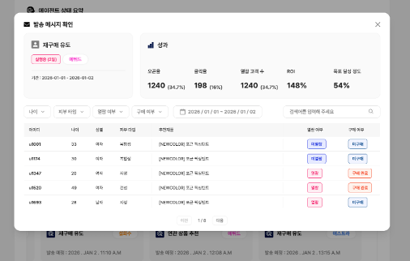
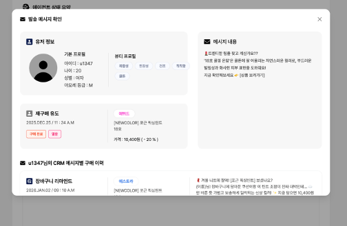
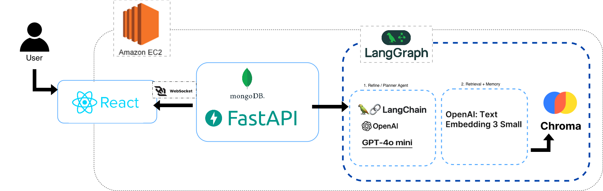

# AMORE PARTY – Frontend
**Team AMORE PARTY**의 **[아모레퍼시픽] 2026 AI INNOVATION CHALLENGE**  
CRM 메시지 자동 생성 트랙 출품작입니다.

---

## 프로젝트 개요

본 프로젝트는 **데이터 기반 초개인화 CRM 메시지를 자동으로 기획·생성·개선하는 AI Agent**입니다.  
React 기반 프론트엔드 구현과 **에이전트 학습을 위한 데이터 크롤링**을 담당했습니다.

전체적인 시스템 흐름은 아래와 같습니다.

---

## 문제 정의

현재 CRM 메시지 운영은 여전히 마케터의 수작업 기획에 크게 의존하고 있습니다.  
캠페인 목적 설정, 타겟 조건 정의, 추천 상품 선정, 메시지 문구 작성까지 대부분 사람이 직접 수행해야 하며, 이 과정에서 많은 시간과 리소스가 소요됩니다.

또한 구매 이력, 장바구니, 찜, 조회 등 다양한 고객 행동 데이터가 축적되고 있음에도 불구하고, 실제 메시지에는 고객의 **미세한 행동 맥락**이 충분히 반영되지 못하는 경우가 많습니다.

이에 본 AI Agent는 다음을 목표로 설계되었습니다.

- 고객 행동 데이터를 기반으로 메시지 목적을 자동 판단
- 목적에 적합한 상품 추천 및 메시지 구조 자동 생성
- 브랜드 톤 & 정책에 맞지 않는 결과를 자동 필터링하여  
  마케터의 반복적인 검토 개입을 최소화
---

## 🔗 Demo

### 서비스 배포 링크  
  👉 http://amoreparty.s3-website.ap-northeast-2.amazonaws.com/charts

### 시연 영상 

  

---
## 기능 소개

본 프로젝트는 마케터에게 **다섯 가지 핵심 기능**을 제공합니다.

### 1. AI Agent 전략 대기열

AI Agent가 성과 분석 결과를 바탕으로 향후 실행 예정인 마케팅 전략을 **시간 순으로 정리**하여 제공합니다.  
각 카드에는 캠페인 분석 요약, 대상 브랜드, 예정 실행 시점이 명확히 표시됩니다.

이를 통해 사용자는 AI Agent가 어떤 전략을 준비 중인지 사전에 인지할 수 있으며,  
단발성 메시지 생성기가 아닌 **계획 기반으로 캠페인을 운영하는 주체**임을 확인할 수 있습니다.

---

### 2. AI Agent 상태 요약 (실행 중 캠페인)

현재 AI Agent가 실행 중인 캠페인을 **요약 카드 형태**로 제공합니다.  
각 카드에는 캠페인 목적, 실행 기간, 핵심 KPI가 함께 표시됩니다.

마케터는 여러 캠페인을 한눈에 비교하며 운영 상태를 실시간으로 파악할 수 있으며,  
필요 시 캠페인 중단 또는 상세 분석으로 이동하는 **Human-in-the-loop 구조**를 지원합니다.

---

### 3. AI Agent 자동 운영 로그

AI Agent는 캠페인 실행 이후 성과를 지속적으로 모니터링하며  
조건 변경, 전략 수정, 실행 중단 등의 판단을 자동으로 수행합니다.

본 기능은 이러한 **의사결정 이력**을 시간 순 로그 형태로 제공하여,  
AI가 어떤 이유로 전략을 수정했는지 투명하게 확인할 수 있도록 합니다.

---

### 4. 성과 분석 차트 (KPI 기반)

AI Agent는 캠페인 성과를 오픈율, 클릭률, 전환율, ROI 등 다양한 지표로 분석합니다.  
브랜드별·지표별 성과 추이를 시각화하여 제공합니다.

해당 결과는 단순 리포트를 넘어,  
**다음 전략 수립을 위한 AI Agent의 입력값**으로 활용됩니다.

---

### 5. 메시지 상세 및 사용자 단위 결과

AI Agent가 생성한 메시지를 **사용자 단위로 상세 확인**할 수 있는 핵심 기능입니다.  
각 사용자에 대해 메시지 내용, 열람 여부, 구매 여부를 함께 제공합니다.

이를 통해 개인화 메시지가 실제 행동 변화로 이어졌는지를 직관적으로 파악할 수 있으며,  
전략 → 실행 → 성과가 **개별 사용자 수준까지 연결됨**을 확인할 수 있습니다.

| 메시지별 사용자 조회                   | 사용자별 초개인화 메시지                 |
|-------------------------------|-------------------------------|
|  |  |

---

## ✨ 시스템 아키텍처

---

## 🛠 Tech Stack

### Frontend
- **Framework**: React / Next.js
- **Styling**: Tailwind CSS
- **Deployment**: Vercel
- **Design Tool**: Figma

### Backend
- WebSocket
- LangGraph, LangChain, OpenAI, Chroma
- AWS

---

## Team Member

- **이종환** : Backend, AI Agent, Team Leader
- **권하영** : Backend, AI Agent
- **박민정** : Frontend, Data Crawling
- **정성희** : 기획, UI/UX 디자인
- **오현지** : 기획

## 개발기간
- 2025.12.22 ~ 2026.01.04

---

## 확장 가능성 

- **실시간 취향 반영**  
  최근 클릭·조회·반응 데이터를 기반으로 고객의 현재 관심 단계를 동적으로 추론

- **메시지 전략 자동 고도화**  
  클릭·전환·이탈 데이터를 누적 학습하여 타이밍·톤·상품 추천 전략을 지속적으로 개선

- **라이프사이클 기반 CRM 전환**  
  구매 이후 소진 주기와 행동 맥락을 고려한    관계 유지형 메시지 전략으로 확장

> 고객 반응이 쌓일수록 AI Agent의 판단은 점점 더 정교해지며,  
> 별도 설정 없이도 **자가 최적화되는 CRM 운영 구조**를 지향합니다.